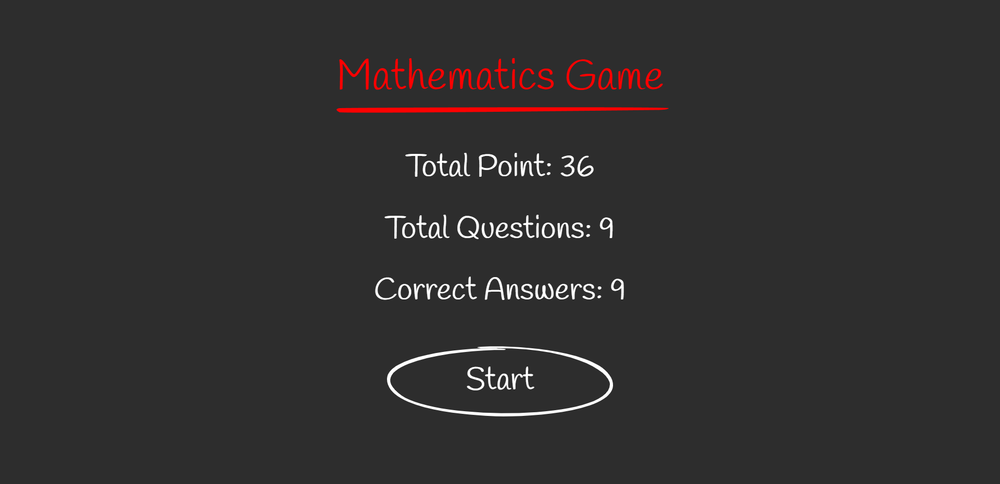
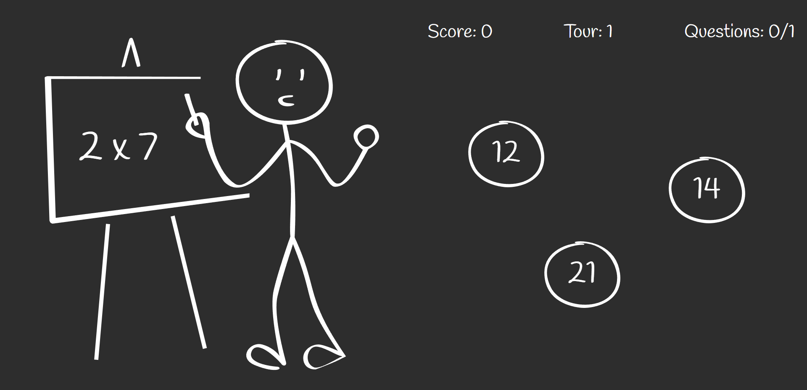
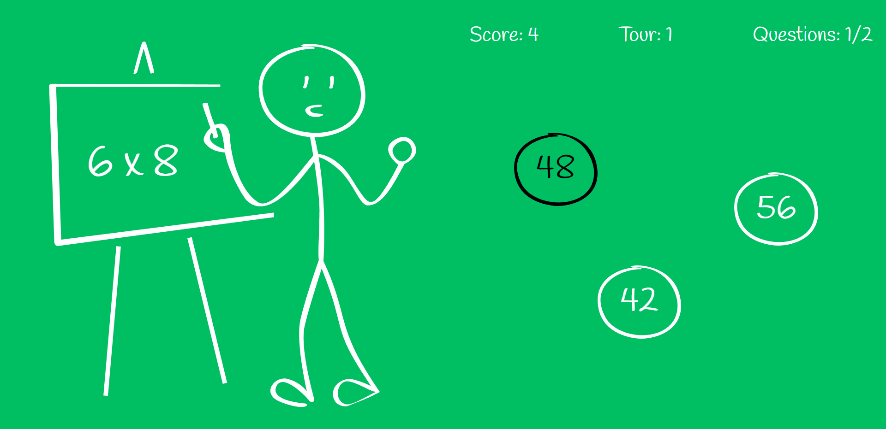
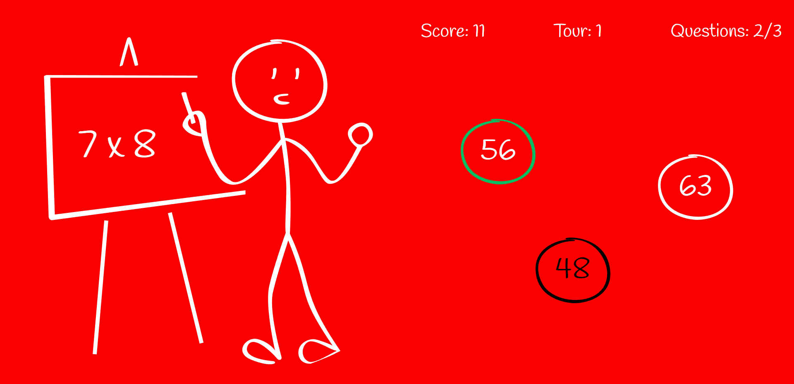
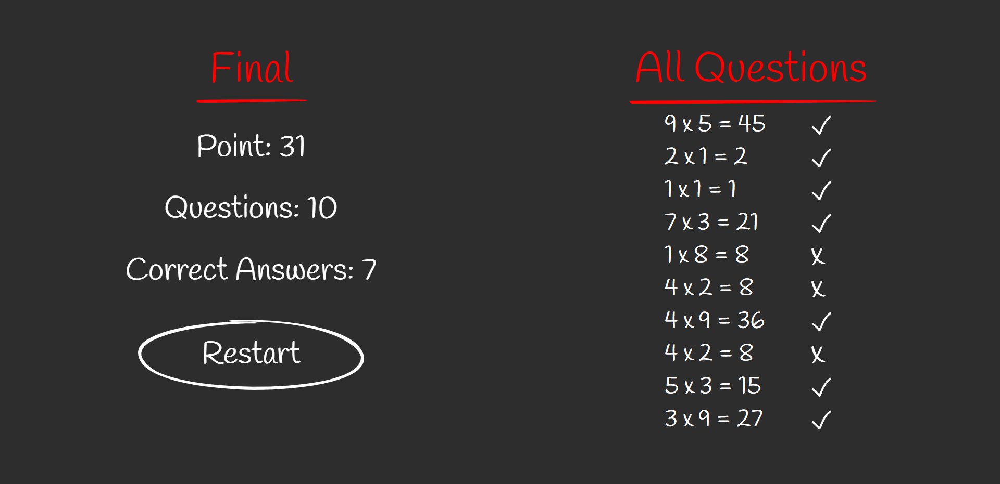
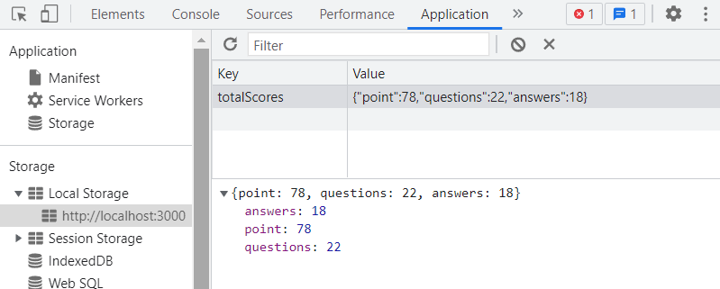

# Week 4 Assignment
You can find the live version of the application [here](https://react-bootcamp-week4-assignment.vercel.app/).

In this assignment, a math game was implemented with React. React router, hooks, localStorage and context structures are used in the application. When it is first turned on, the total score data starts from 0 and is saved to the local storage. On the tour page, 10 questions, 2 wrong answers and one correct answer are displayed. The numbers in the answers and questions are set randomly. A certain point is earned for each question. When 10 questions are completed, the scores of that round and the solved questions are displayed on the screen.

## Home Page

## Tour Page

## Outcome Page

## Local Storage View

